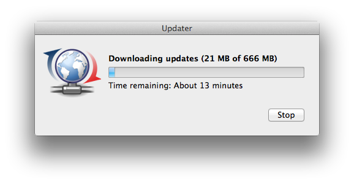

<a href="#">
    
</a>

# QSimpleUpdater

[](#)

QSimpleUpdater is an implementation of an auto-updating system to be used with Qt projects. It allows you to easily check for updates, download them and install them. Additionally, the QSimpleUpdater allows you to check for updates for different "modules" of your application. Check the [FAQ](#faq) for more information.

Online documentation can be found [here](http://frc-utilities.github.io/documentation/qsimpleupdater/).

[](etc/screenshots/)

## Integrating QSimpleUpdater with your projects
1. Copy the QSimpleUpdater folder in your "3rd-party" folder.
2. Include the QSimpleUpdater project include (*pri*) file using the include() function.
3. That's all! Check the [tutorial project](/tutorial) as a reference for your project.

## FAQ

### 1. How does the QSimpleUpdater check for updates?

The QSimpleUpdater downloads an update definition file stored in JSON format. This file specifies the latest version, the download links and changelogs for each platform (you can also register your own platform easily if needed).

After downloading this file, the library analyzes the local version and the remote version. If the remote version is greater than the local version, then the library infers that there is an update available and notifies the user.

An example update definition file can be found [here](https://github.com/alex-spataru/QSimpleUpdater/blob/master/tutorial/definitions/updates.json).

### 2. Can I customize the update notifications shown to the user?

Yes! You can "toggle" which notifications to show using the library's functions or re-implement by yourself the notifications by "reacting" to the signals emitted by the QSimpleUpdater.

```c++
QString url = "https://MyBadassApplication.com/updates.json";

QSimpleUpdater::getInstance()->setNotifyOnUpdate (url, true);
QSimpleUpdater::getInstance()->setNotifyOnFinish (url, false);

QSimpleUpdater::getInstance()->checkForUpdates (url);
```

### 3. Is the application able to download the updates directly?

Yes. If there is an update available, the library will prompt the user if he/she wants to download the update. You can enable or disable the integrated downloader with the following code:

```c++
QString url = "https://MyBadassApplication.com/updates.json";
QSimpleUpdater::getInstance()->setDownloaderEnabled (url, true);
```

### 4. Why do I need to specify an URL for each function of the library?

The QSimpleUpdater allows you to use different updater instances, which can be accessed with the URL of the update definitions.
While it is not obligatory to use multiple updater instances, this can be useful for applications that make use of plugins or different modules.

Say that you are developing a game, in this case, you could use the following code:

```c++
// Update the game textures
QString textures_url = "https://MyBadassGame.com/textures.json"
QSimpleUpdater::getInstance()->setModuleName    (textures_url, "textures");
QSimpleUpdater::getInstance()->setModuleVersion (textures_url, "0.4");
QSimpleUpdater::getInstance()->checkForUpdates  (textures_url);

// Update the game sounds
QString sounds_url = "https://MyBadassGame.com/sounds.json"
QSimpleUpdater::getInstance()->setModuleName    (sounds_url, "sounds");
QSimpleUpdater::getInstance()->setModuleVersion (sounds_url, "0.6");
QSimpleUpdater::getInstance()->checkForUpdates  (sounds_url);

// Update the client (name & versions are already stored in qApp)
QString client_url = "https://MyBadassGame.com/client.json"
QSimpleUpdater::getInstance()->checkForUpdates (client_url);
```

## License

QSimpleUpdater is free and open-source software, it is released under the [DBAD](COPYING.md) license.
