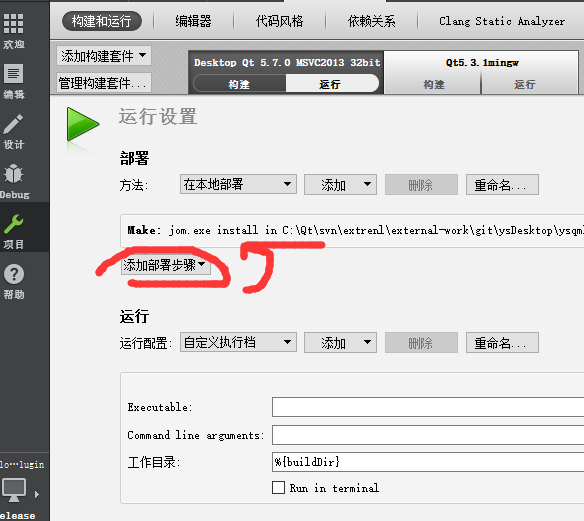
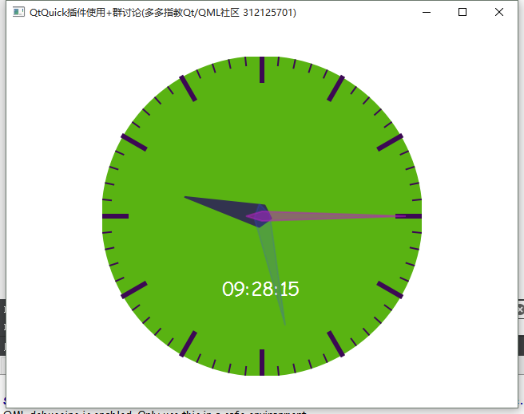

### QML时钟插件开发简单指导

QtQuick Website: http://www.heilqt.com




#### 描述

* QML插件以C++来实现绘制QML的组件

* 功能:

* 自由绘制需要的图形
* 自由定制属性(暴露属性给QML)
* 组件不可见可以将时钟停止运行


#### 编译方法

* 下载YSClockPlugin项目
* 打开QtCreator IDE
* 清理项目进行编译
* 记得在QtCreator项目配置加入make install的步骤
* 点击运行
* 插件被安装到当前版本的QtSDK的qml插件目录(具体查看pro里面的install配置项)

#### 使用方法

* 新建QML项目
* 在main.qml中加入 import com.ys.qmlcomponents 1.0
* 在qml中加入YSClockPlugin对其进行属性配置和布局
* 可以自由调整各种颜色

```
    YSClockPlugin{
        id:clock
        anchors.fill: parent
        smooth: true
        anchors.centerIn: parent
        hourColor:"#32334f"
        secondColor:"red"
        minuteColor:"#32334a"
        lineColor:"#3C0854"
        textColor:"white"
        background:"#04D56C"
        ysfamily:"Comic Sans MS"
    }
```

#### 暴露属性
```
        hourColor:"#32334f"
        minuteColor:"#32334a"
        secondColor:Qt.rgba(Math.random(),Math.random(),Math.random(),0.5)
        lineColor:"#3C0854"
        textColor:"white"
        background:"#04D56C"
        ysfamily:"Comic Sans MS"

```

## 贡献

* [寒山-居士](https://github.com/toby20130333)
* [toby520](http://www.heilqt.com)
